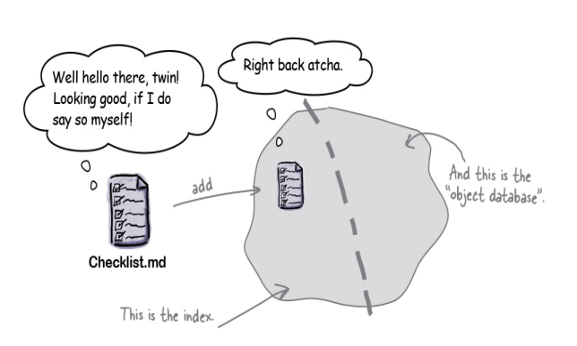
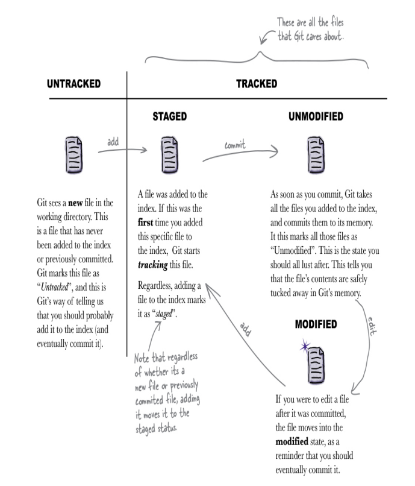
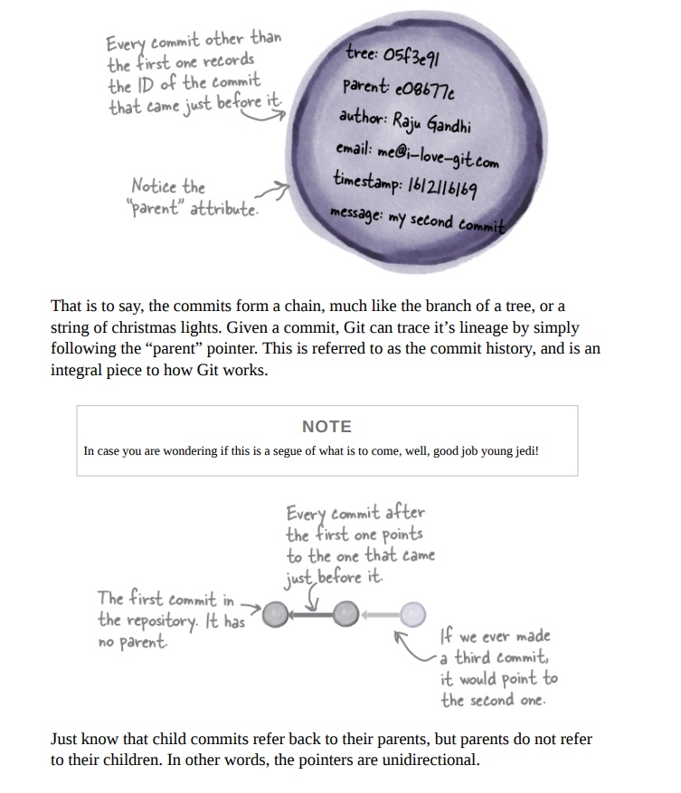
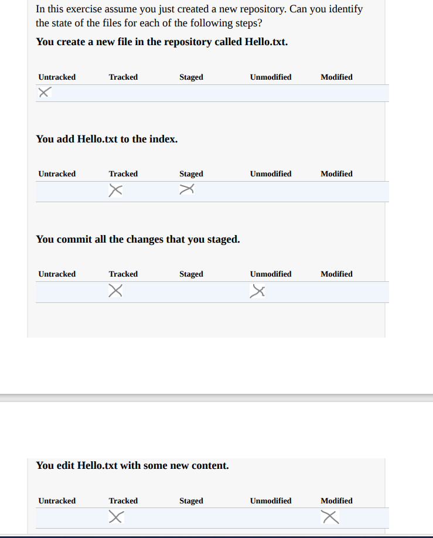
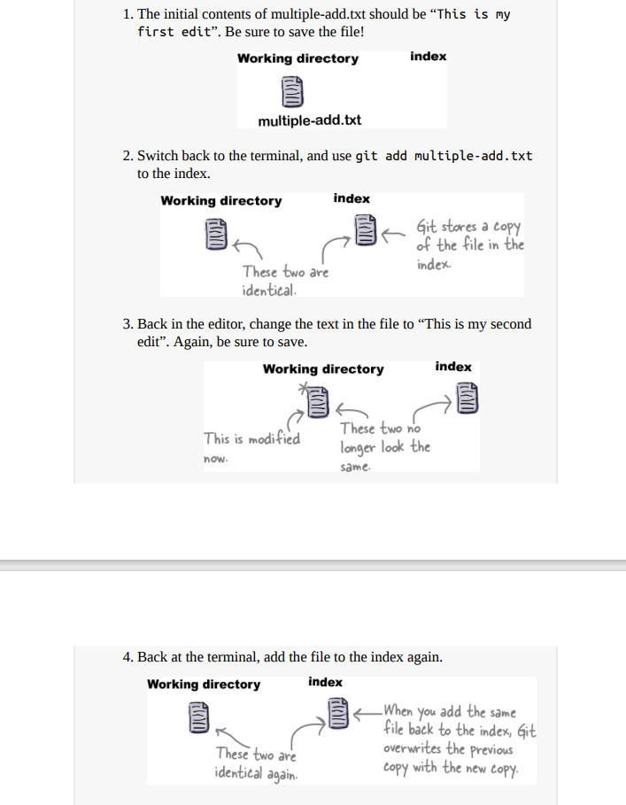

## Version control:

Version control allows you to do with your work. It gives you a way to save your progress. You can do a little bit of work, save your progress, and continue working.

Git allows you to confidently collaborate with your fellow
developers over the same set of files, without stepping on each others toes.

A Git repository is a folder that is managed by Git.

If we want to manage files with Git, then the first step is to create a Git repository.

Creating a Git repository involves running the git init command inside the top folder of your project.No matter how big your project is (in other words, no matter how many files or
sub-directories your project has), the top (or root) folder of that project needs to have git init run to get things started with Git.

`git init` // means initialize

Git expects you to tell it a few things about yourself, You only have to do this once, and this will apply to any and all projects that you work with on your machine.

`git config --global user.name "Dias Raphael"`

`git config --global user.email "diasraphael88@gmail.com"`

To save changes or commit to our repo

`git add readme.md`

`git commit -m "added the readme changes"`

## What exactly does it mean to commit?

We saw that committing to Git is a two-step process. You first add the files and then commit.The first thing to know is that only the files that you add are committed. Let’s say you had two files—Checklist.md and README.md, but you only added Checklist.md. When you create a commit, Git will only store the changes made
to Checklist.md.

Now, when we commit, Git uses a specialized algorithm to safely tuck away everything that we added in it’s memory. When we say we “committed” our changes to Git, what that translates into is that Git creates a commit object that it stores inside the .git folder. This commit object is ‘stamped’ by a unique identifier. we got 3dc1ea2 actually a much longer string containing numbers and letters.

The commit object does not actually store your changes—well not directly anyway. Instead, Git stores your changes in a different location in the Git repository, and simply records (in the commit) where your changes have been stored.

## About git add and commit

The Git repository itself is divided into two parts—the first part is called the “index”, and the second part is what we will refer to as the “object database”.c

When we run git add <filename> Git makes a copy of the file, and puts it in the index. We can think of the index as the “staging area”, wherein we can put things till we are sure we want to commit to them. Now when we run git commit takes the contents of the staging area and stores those in the object database, a.k.a Git’s memory bank. To put it another way, the index is a place to temporarily house changes. Typically, you make some changes, add them to the index, and then decide if you are ready to commit—if
yes, then you make a commit. Else, you can continue making changes, add more changes to the staging area, and then when you feel you are in a good place, commit.

So what happens when we commit? Well, as we know, Git takes the contents of the index, tucks those safely into it’s memory bank, and represents that version with a commit object. This means that now, Git has a third copy of your files contents in its object database!

Every file in the working directory is assigned one or more states.

A brand new file added to the working directory is marked as
“Untracked” which suggests that Git does not know about this file.

Adding a new file to Git’s index does two things—it marks the file
as being “tracked”, and creates a copy of that file into the index.

When you make a commit, Git creates a copy of the files in the
index and stores them in the object datastore. It also creates a
commit object that records metadata about the commit, including a
pointer to the files that were just stored, the author name and email, the time the commit was made, as well as the commit message.

Every commit in Git is identified by a unique identifier, refererred to as the commit ID.

## states:

