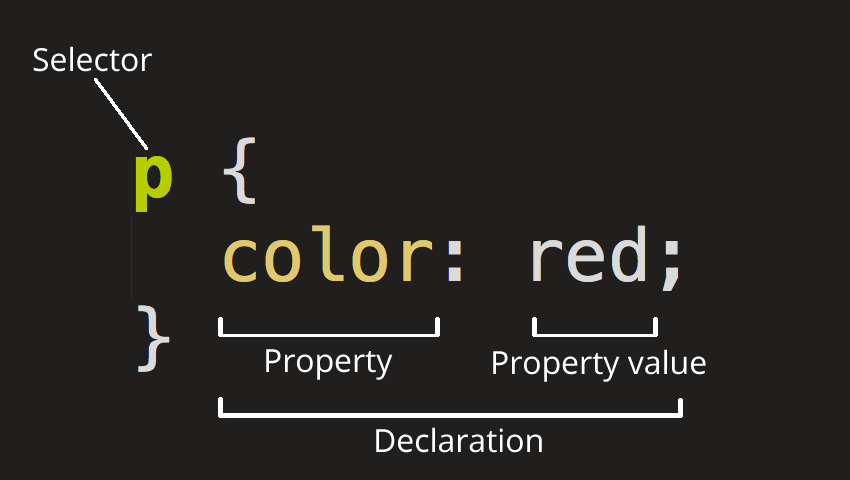

## CSS (Cascading Style Sheets)

is the code that styles web content.

CSS is not a programming language. It's not a markup language either. CSS is a style sheet language. CSS is what you use to selectively style HTML elements.



The whole structure is called a ruleset. (The term ruleset is often referred to as just rule.)

Since <html> is the parent element of the whole page, all elements inside it inherit the same font-size and font-family.

```
html {
  font-size: 10px; /* px means "pixels": the base font size is now 10 pixels high */
  font-family: "Open Sans", sans-serif; /* this should be the rest of the output you got from Google Fonts */
}
```
