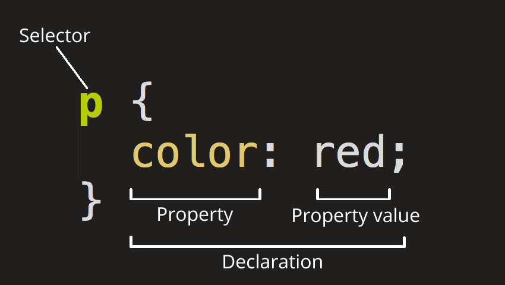

## CSS (Cascading Style Sheets)

is the code that styles web content.

CSS is not a programming language. It's not a markup language either. CSS is a style sheet language. CSS is what you use to selectively style HTML elements.

#### Element

3 parts  
opening tag  
content  
closing tag

#### Semantic elements

b to strong  
i to em  
you can wrap nav and h1 tag under header tag(to be semantic tags)

### Rule or ruleset

The whole structure is called a ruleset. (The term ruleset is often referred to as just rule.)



### Style inherit

Since html is the parent element of the whole page, all elements inside it inherit the same font-size and font-family.

```
html {
  font-size: 10px; /* px means "pixels": the base font size is now 10 pixels high */
  font-family: "Open Sans", sans-serif; /* this should be the rest of the output you got from Google Fonts */
}
```

## css tricks

### css reset

```
*{
  margin:0;
  height: 0;
  box-sizing: border-box;  // to change the box-model to set borders and paddings are not added to the elements
}
```

### set background image with linear gradient

```
*{
 background-image: linear-gradient(to right bottom, #72d56f, #28b485), url(../img/hero.jpg);
 background-size:cover;
 background-position: top; // can have center, bottom try it
}
```

rgba red blue green opacity<br />
can change the opacity by clicking on the color in vscode and pull the opacity level to .8 in color picker.

### clip path feature in css to clip the image

```
clip-path: polygon(0 0, 100% 0, 100% 75%, 0 100%);
```

for different clip types go to
bennettfeely.com/clippy

### to set the logo in the header

```
.header{
  position: relative;
}
.logobox{
  position: absolute;  // container should have relative to make context to it
  top:40px;
  left: 40px;
}
.logo{
  height: 35px;  // can set only the height and width will be automatically figured out and vice versa
}
```

```
<header class="header">
  <div class="logo-box">
    
  </div>
</header>
```

### to center anything with transform, top, left properties

```
.center-box{
  position: absolute;
  top: 50%;
  left: 50%;
  transform: translate(-50%, -50%);
  text-align: center;
}
.wrapper{
  backface-visibility: hidden;   // when we use the animation, there is a shake , to avoid this we have added this on the parent element
}
.header{
  animation-name: moveInLeft;
  animation-duration: 5s;
  animation-timing-function: ease-out;
  // animation-delay: 3s;
}
.sub-header{
animation: moveInRight  1s ease-out;
}
```

```
<div class='center-box'>
  <div class="wrapper">
    <div class="header">Outdoors<div>
    <div class="sub-header">is where the life starts</div>
  </div>
</div>
```

### spacing between the letters

```
letter-spacing: 35px;
```

### create animations using keyframes and animation property

```
@keyframes moveInLeft {
0%{
opacity: 0;
transform:translateX(-100px)
}
80%{
transform:translateX(10px)
}
100%{
opacity: 1;
transform:translateX(0)
}
}

@keyframes moveInRight {

0%{
opacity: 0;
transform:translateX(100px)
}

80%{
transform:translateX(-10px)
}

100%{
opacity: 1;
transform:translateX(0)
}

}

@keyframes moveInBottom {

0%{
opacity: 0;
transform:translateY(30px)
}


100%{
opacity: 1;
transform:translateY(0)
}

}
```

### what are pseudo elements and pseudo classes

\ why to use pseudo element

\ how to create hover animation effect using transition property

```
.btn:link,
.btn:visited{
  text-decoration: none;
  padding: 15px 40px;
  display: inline-block;
  border-radius: 100px;
  transition: all .2s;
}
.btn:hover{
  transform: translateY(-3px);
  box-shadow: 0 10px 20px rgba(0,0,0,.2);
}
.btn:active{
  transform: translateY(-1px);
   box-shadow: 0 5px 10px rgba(0,0,0,.2);
}
.btn::after{
  content: '';
  display: inline-block;
  height: 100%;
  width: 100%;
  border-radius: 100px;
  position: absolute;
  top:0;
  left:0;
  z-index: -1;
  transition: all .4s;
}
.btn-white::after{
  background-color: #fff;
}
.btn:hover::after{
  transform:scaleX(1.4) scaleY(1.6);
  opacity: 0;
}
.btn-animated{
  animation: moveInBottom .5s ease-out .75s;
  animation-fill-mode: backwards;
}
```

## Notes:

1. Good practise to have one h1 in a page
2. we need to mention lang attribute to en to html

```
<html lang="en">
```

3. jonas.io (resources links)
4. line-height: 1.5(without giving px it will be 1.5 times of the font-size of the element)
5. article header p {} will make the structure not maintainable should avoid this
6. a:link selects all the anchor tag with href attribute
7. order of adding style to a tag is link, visited, hover, active
8. final width of the element = left border + left padding + content + right padding + right border
9. to provide spaces between elements always prefer margins, and to provide vertical space choose margin bottom.
10. only width or height is enough to automatically scale the image.(dont want to mention both, avoid mentioning in html along with image inline style)
11. centering our page trick

```
    .container{
    width: 700px;
    margin: 0 auto;
    }
```
