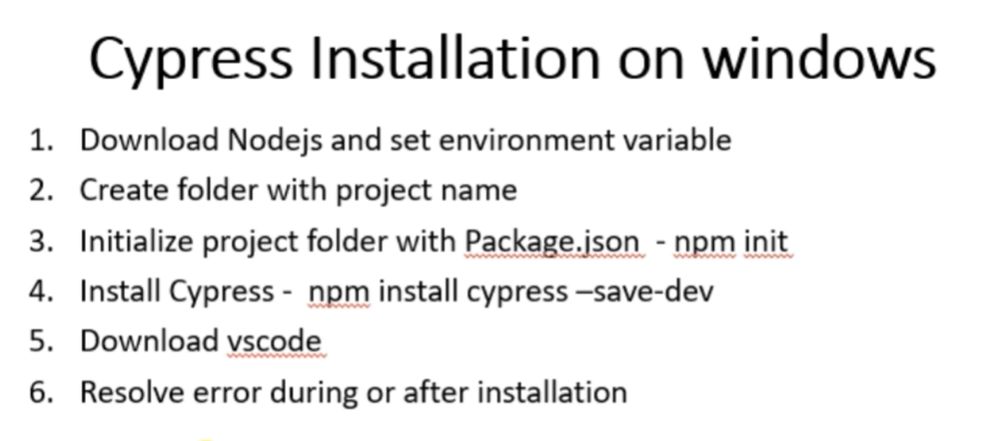

## Cypress

#### Installation procedure

### uploading files in cypress

1. Download and install cypress-file-upload plugin

2. import the plugin

3. use attachFile() function to upload files

4. test files should be stored in fixture folder

### to read data from xls file

1. npm install xlsx

2. write code to convert xlsx to json data

3. user foreach loop to iterate json data for testing

4. create worksheet object and worksheet use the method from xlsx to convert the sheet to json data

5. and pass the json data to the stringfy method and write to a file

### how to locate web elements using Xpath

1. install cypress-xpath and it will be present in the developer console as extension(chropath)

### API testing

1. cy.request('GET', 'url', {
   'name': 'dias'
   }).then((response)=>{
   expect(response.status).equal(200)
   expect(response.body.data[1].id).equal(8)
   })

   cy.request('POST', 'url').then((response)=>{
   expect(response.status).equal(200)
   expect(response.body.data[1].id).equal(8)
   })

## Notes

1. take xpath using developer console

2. when dealing with iframe we need this setting.(to handle cross platform iframes)

   In cypress.json { chromeWebSecurity : false}
