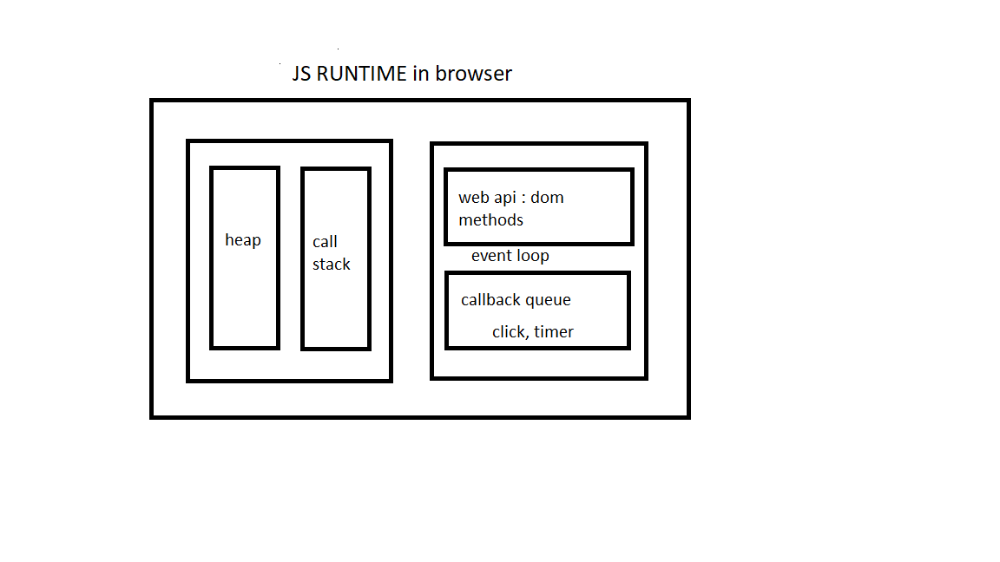

# Javascript

1. high level language = need memory to store variable, in high level language it will be done automatically
   in low level language like c the developer need to manage resource manually.(memory management will be done under the hood)
2. multi paradigm (approach and mindset of structuring code which will direct your coding style and technique)
   procedural, object oriented programming, functional programming
3. object oriented (based on objects, for storing most kinds of data)
4. garbage collected(garbage will be collected automatically)
5. javascript is interpreted or just in time compile.code is converted to machine code 0s and 1s.this step is called compiling or interpreting.this is done in javascript engine.
6. prototype based object oriented
7. first class functions, functions are simply treated as variables.we can pass them into other functions and return them from functions.
8. dynamically typed.
9. single threaded
10. non blocking event loop: handles multiple task at same time. javascript runs in one single thread.so it can only do one thing at a time.so how do we achieve multiple task at a time. answer is event loop. even loop takes long running tasks and executes them in the background. and puts them in the main thread once they are finished.

### Releases

Brendan Eich creates Javascript initially called mocha in 10days in 1995  
mocha changed to livescript in 1996  
1997 Ecmascript 1: first official standard for javascript  
2009 Ecmascript 5: released with lot of new features  
ES2015/ES6: biggest update to the language ever  
Ecmascript changes to annual release cycle inorder to ship less features per upgrade

ES5  
ES2015/ES6  
ES2016/ES7  
...  
ES2020/ES11

#### JS engine

1. program that executes javascript code.
2. v8 in chrome, nodejs
3. js engine has call stack, heap
4. call stack is where the code is executed
5. heap is where the objects are stored.
6. code is parsed and then it is compiled and then it is executed.execution happens in call stack.
   
7. execution context: global execution context is created. javascript is executed in the execution context.first top level code will be declared eg: variable declaration, functions.after that execution of functions and callback are excuted when event loop tells which one to execute.
8. there are global scope, function scope, block scope.

#### compilation vs Interpretation

compilation: entire code is converted into machine code at once and written to binary file that can be executed by a computer.

Interpretation: runs through the source code and executes it line by line.

Just in time compilation: entire code is converted into machine code at once then executed immediately.

#### imperative vs declarative

#### Backward compatibility:

code written in 1997 put in new browser will work  
old features are never removed  
javascript supports backward compatibility

#### forward compatibility:

code written in ES2089 will not work in current browser.  
In production we can use transpilers and polyfilling to support old browsers  
ES5 is support in all browsers eg: works in IE11  
javascript dont support forward compatibility

#### hoisting

variables are lifted to the top of their scope.function declarations are hoisted.var is hoisted .let and const are not hoisted.function expression are hoisted depends on whether it is declared with ler or var.

#### temporal dead zone

accessing variables before declaration is bad practise and should be avoided.

#### Dynamic typing:

we do not manually define type of the value, instead datatypes are determined automatically in javascript.

#### let,var,const

we cannot reassign using const,using let we can reassign.

var allows adding variables without adding var keyword.(notrecommended)

#### Type conversion and coercion

Type conversion: manually converting from one type to another.

coercion: javascript converts the type automatically from one type to another.

Number('Dias') // returns NaN

#### falsy values

0, '', undefined, null, NaN

#### == vs ===

=== will check the type and the value(will not perform coercion).prefer always this operator.
== will perform coercion and checks the value

#### use strict

it has to be the first line of the code.  
it forbids to introduce new errors.  
it creates visible errors on the developer console otherwise it will fail silently.

#### functions

1. function declaration:

```
const value = calculate(5) // works
function calculate(value){
return value;
}
```

we can call the function before the function definition.

2. function expression:

```
const value = calculate(5) // does not work
const calulate = function (value){
return value;
}
```

we cannot call the function before the function definition.

3. arrow function:

```
const calculate = (value)=>value
```

this keyword is not available in arrow function

#### Arrays

push method returns the length of the array

```
const arrayName = ['Raphael']
const length = arrayName.push('Dias') // 2
```

pop method returns the deleted element

```
const deletedElement = arrayName.pop('Raphael') // Raphael
```

includes method returns whether the element exist in the array or not

indexOf method returns index of the element where it is present

#### Objects

Accessing dynamic value

```
obj ={
firstName:'Dias',
lastName:'Raphael',
birthYear: 1988,
calcAge: function(){
return currentYear - this.birthYear;
}
}

const namekey = 'Name'

console.log(obj['first'+nameKey])
console.log(obj['calcAge']())  // calling method using bracket syntax
```

#### DOM

1. DOM is the complete representation of the HTML page we write
2. we can modify the html structure using document object
3. DOM methods and properties not part of javascript instead they are the apis of browsers
4. timers, fetch api is also from browser apis

#### copying objects using Object.assign({},obj)

object.assign will do a shallow copy of the object

```
let obj = {
firstName: 'Dias',
lastName: 'raphael',
friends:['x','y','z']
}
let newObj = Object.assign({},obj)
newObj.firstName = 'anie';
console.log(obj) // will print an obj with firstname as Dias
console.log(newObj)  // will print an obj with firstname as anie
newObj.friends.push('ac')
console.log(obj) // will print an obj with friends as ['x','y','z', 'ac'] , both will point to the same updated object
console.log(newObj)  // will print an obj with firstname as ['x','y','z', 'ac'v]
```

to avoid this we need to do a deep copy which is not easy.TODO to know more

## Notes:

1. Javascript can be used in the web servers(run outside of browsers eg: nodejs)
2. Javascript can be used in the native mobile applications(ionic, react)
3. Javascript can be used in the native desktop applications(electron)
4. instead of multiple if else block we can include switch so we can avoid multiple conditions and switch will be much more clear.
