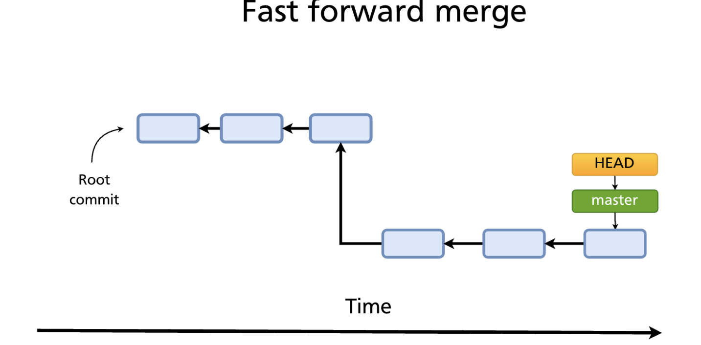
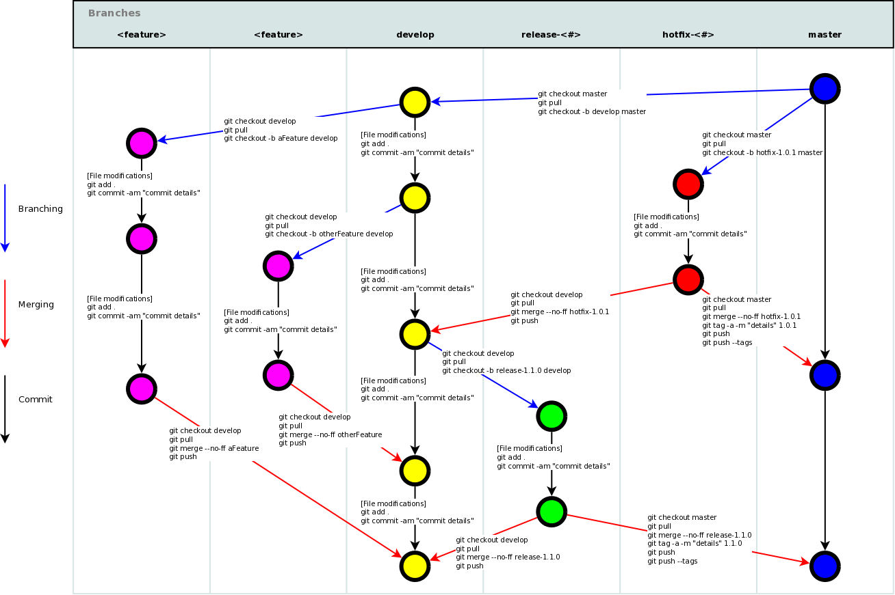

# GIT

### GIT vs GITHUB

1. GIT is a distributed version control system
2. GIT helps in tracking different versions of the file
3. GIT helps in collaborating with multiple people in the team
4. SHA1 is used by GIT ie is 160bits
5. GITHUB is the repository hosting service

### ZSH

1. its a custom shell with some good information of the screen
2. we need to set this as a default shell if we need to use it.

### Basic shell cmds

1. mkdir - to make directory
2. ls to list files and directories
3. . alias of the current directory
4. .. alias of the parent directory
5. clear - to clear the terminal
6. echo - to print in the terminal
7. touch to create a file
8. nano to edit a file
9. echo "hello" > file.txt // creates a file and inserts the code in the file
10. cat file.txt // print hello in terminal
11. > > appends to the file // echo "Dias" >> file.txt
12. rm -rf folder-name // to delete the file without asking for permission

### git init

1. creates a new git repository
2. creates .git folder within the root folder
3. .git folder is managed by git and dont modify manually.

### working directory vs staging directory vs git repository

1. staging area sits between the working directory and git repository
2. from working directory we need to add the files to staging area to push into git repository
3. git ls-files -s

### setting username and email for git

1. git config --global user.name "Dias"
2. git config --global user.email "diasraphael88@gmail.com"
3. git config --list

### staging and unstaging

1. git add file.txt // to stage a file
2. git rm --cached file.txt // to unstage a file

### branch

1. default branch is master
2. branch pointer moves automatically after ever new commit.

### head

1. head is reference to the currently checkout branch or commit
2. there is only one head

### merging branching

a. git checkout master
b. git merge feature

#### merging process

1. fast forward merge: there are 2 branches master,feature. we have added some commits in feature branch and now we want to merge it back to master. so we check out master branch and then we will give command as git merge feature. then git checks if there are any commits on top of master after feature branch has been created. if not it will do fast forward merge ie it will move the head after merging the commits from feature to master and head will be on top. if there are commits on top of master, then fast forward is not possible.




2. 3 way merge:
   there are 2 branches master,feature. we have added some commits in feature branch and now we want to merge it back to master. so we check out master branch and then we will give command as git merge feature. then git checks if there are any commits on top of master after feature branch has been created. if present then git decides to do 3 way merge.

To list all the branches
`git branch`

To create a new branch
`git branch branchname`

To Merge
`git checkout branchname`
`git merge master`

To delete a branch
`git branch -d branchname`

To List the commits in the branch
`git log`

git pull
It is the short hand for git fetch and git merge branchname

## Git workflow



### Develop

Create feature from develop

Merge it back to develop

Create release from develop

Merge release to master

Merge release to develop

### Master

Create hotfix from master

Merge hotfix to master

Merge hotfix to develop

Git-flow to automate this process

#### Git tags

It is used to mark the release version we use tags

git push --tags will push the tage we have created in local

#### Git stash

Stash will remove the changes from local

To list all the stashed changes

```
git stash list

git stash pop stash@{0} // to select corresponding stash

To delete the list from stash

git stash drop stash@{0}

To see the contents in stashed content

git stash show stash@{0}
```

#### cherrypick

To copy your changes from one branch to another branch

```
git checkout develop

git cherry-pick a3747567
```

The contents from other branch is copied to develop branch as new commit. hash-id can be taken using git log

### Using different names to push changes to github

Each project will have a .git folder, go inside and do the below cmd

```
git config user.name dias

git config user.email diasraphael@gmail.com
```

### Using alias to git cmds

```
git config alias.s status

git s

git config alias.co checkout

git config alias.c commit

git config alias.p push

Inside gitconfig

alias gs 'git status'

To go back to the previous commit

git reset --hard HEAD

to go back to previous committed commit

git reset --hard commitID

you can get the commitID by typing git log
```

## Notes

1. git cat-file -p <hash> contents of the object // to read the information of the object
2. git cat-file -s <hash> size of the object
3. git cat-file -t <hash> type of the object
4. create new git blob object // git hash-object filname -w
5. blob will have the contents of the file
6. git log // to see the history of changes(commits)

`https://education.github.com/git-cheat-sheet-education.pdf`
